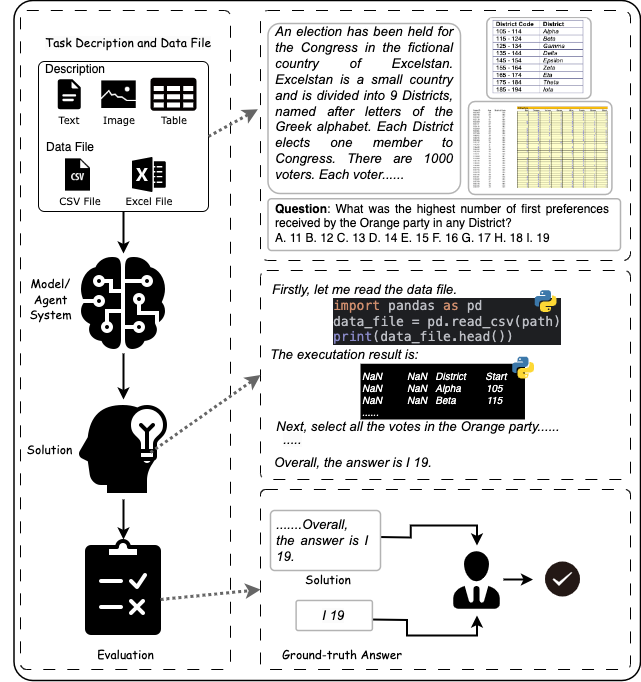
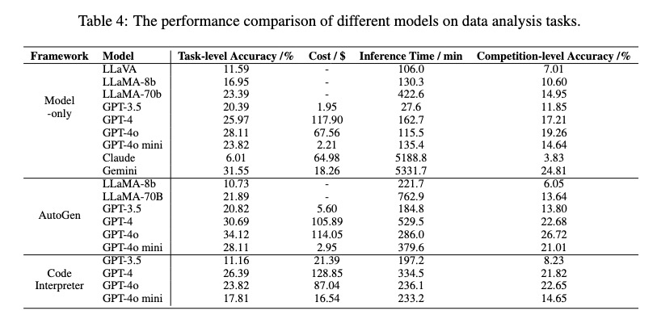
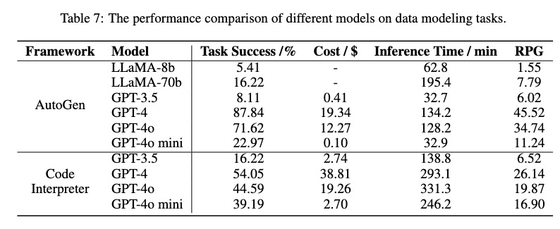

# DSBench

## Overview
DSBench is a benchmark for evaluating data science agents with 
realistic data analysis and data modeling tasks collected from 
modeloff and kaggle. 
Given a *task instruction (may contain image and table)* and
*data files*, a data science agent is tasked with generating 
a *solution* that resolves the described task.

<p align="center">

</p>

## Set Up
For evaluation, you should install the following python packages.
```angular2html
python>3.9
scikit-learn
pandas
tqdm
openai
tiktoken
PyMuPDF
torch
transformers
google.generativeai
openpyxl
anthropic
Pillow
```

## Usage

1. Clone this repo.
2. Install all the requirments in Set Up.
3. For evaluation on data analysis task, refer to [./data_analysis/readme.md](https://github.com/LiqiangJing/DSBench/blob/main/data_analysis/readme.md).
4. For evaluation on data modeling task, refer to [./data_modeling/readme.md](https://github.com/LiqiangJing/DSBench/blob/main/data_modeling/readme.md).

## Results
<p align="center">

</p>

<p align="center">

</p>

##  Disclaimer
The dataset provided is intended solely for educational and research purposes, with the goal of fostering research in related areas. Users of this dataset are required to adhere to the following guidelines:

- Data Source and Accuracy: While efforts have been made to curate and organize the data, we make no guarantees regarding the accuracy, completeness, or timeliness of the dataset. Users are encouraged to independently verify the data's accuracy and assume full responsibility for any conclusions drawn from it.

- Usage Restrictions: This dataset is strictly for non-commercial use. Any commercial development or profit-driven activity requires explicit written permission from the dataset providers.

- Privacy and Compliance: Users must ensure that their use of the dataset complies with all applicable laws and regulations, particularly those related to privacy and data security. The dataset providers are not responsible for any legal consequences arising from improper use of the data.

- Non-Infringement: The pre-processed data provided by us is intended solely for educational and research purposes. We do not claim ownership of the original data, and any use of this data should respect the rights of the original creators. Users are responsible for ensuring that their use of the data does not infringe on any copyrights or other intellectual property rights.

- Disclaimer of Liability: The dataset providers shall not be held liable for any direct or indirect consequences resulting from the use of this dataset, including but not limited to losses, damages, or liabilities arising from reliance on the information contained within the dataset.

##  Citation
If you find our work helpful, please use the following citations.
```
@inproceedings{
}
```


